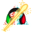

<p align="center">
  
</p>

<h1 align="center">Game webpage</h1>

<blockquote align="center">
Developed game code <a href="https://github.com/nelsonwenner/godot-topdown-shooter">game topdown shooter</a>
</blockquote>

<p align="center">
  

  <a href="https://github.com/nelsonwenner">
    
  </a>
   <a href="https://github.com/ofelipegabriel321">
    
  </a>

  

  <a href="https://github.com/nelsonwenner/ecoleta/stargazers">
    
  </a>
</p>

## :movie_camera: Preview

<div align="center">
  
</div>

## :rocket: Technologies

- [Node](https://nodejs.org/en/)
- [Gatsby](https://www.gatsbyjs.com/)

## :electric_plug: Prerequisites

- [Node.js LTS (>= 12.x)](https://nodejs.org/)
- [Gatsby CLI (>= 2.12.x)](https://www.gatsbyjs.com/)

## :information_source: Getting Started

1. Fork this repository and clone it on your machine.
2. Change the directory to `gatsby-webpage-game` where you cloned it.

## :closed_lock_with_key: Getting started the web application

```shell
/* Install dependencies */
$ npm install

/* Run the project */
$ npm run start
```

- Open frontend, the host [localhost:8000](http://localhost:8000)

## :memo: License

This project is under the MIT license. See the [LICENSE](LICENSE.md) for more information.

---
